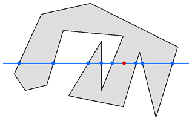

# Build with GeoDIDs

As part of our exploration process we build a system for storing geospatial data on IPFS for a [Filecoin Development Grant](https://github.com/filecoin-project/devgrants/blob/efaac115b71df7b373354c72600aa9818fc6710a/open-grant-proposals/open-proposal-astral-protocol.md) in Q1 2021. This work has informed our thinking abourn building tools for Web3-native satellite imagery, which we're carrying forward.&#x20;


**This project was experimental, and code is not stable. If you'd like to build with Astral tools, reach out on Discord:** [**https://discord.gg/4WPyYvRtzQ**](https://discord.gg/4WPyYvRtzQ)**.**&#x20;


### Data

We're developing Geographic Decentralized Identifiers (GeoDIDs) to provide a Web3-native format for identifying spatial data assets.

### Oracles

To date our oracle systems are quite simple, and we're looking for developers who are interested in implementing those to pull spatial data from GeoDIDs into smart contracts.

### Spatial Contracts

We have been developing patterns and libraries to work with spatial data in smart contracts for a few years now, and are looking for additional support. Specifically, we are working on:

* A Solidity library of geometric and topological functions, much like [Turf.js](https://turfjs.org).
* A verifiable spatial data registry for GeoDIDs:
  * A zone registry, where users can control polygons representing areas of space on, beneath or above the Earth's surface.
* Front-end packages and dApp interfaces to connect with spatial contracts.

