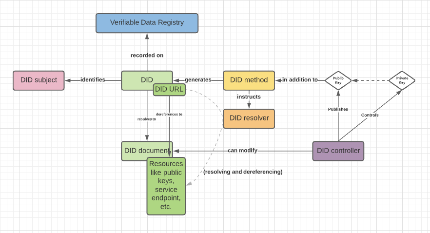

# Primer

## What is a DID?

[Decentralized identifiers](https://www.w3.org/TR/did-core/#dfn-decentralized-identifiers) \(DIDs\) are a new type of identifier that enables verifiable, decentralized digital identity. A [DID](https://www.w3.org/TR/did-core/#dfn-decentralized-identifiers) identifies any subject \(e.g., a person, organization, thing, data model, abstract entity, etc.\) that the controller of the [DID](https://www.w3.org/TR/did-core/#dfn-decentralized-identifiers) decides that it identifies. [DIDs](https://www.w3.org/TR/did-core/#dfn-decentralized-identifiers) are URIs that associate a [DID subject](https://www.w3.org/TR/did-core/#dfn-did-subjects) with a [DID document](https://www.w3.org/TR/did-core/#dfn-did-documents) allowing trustable interactions associated with that subject.

Each [DID document](https://www.w3.org/TR/did-core/#dfn-did-documents) can express cryptographic material, verification methods, or [service endpoints](https://www.w3.org/TR/did-core/#dfn-service-endpoints), which provide a set of mechanisms enabling a [DID controller](https://www.w3.org/TR/did-core/#dfn-did-controllers) to prove control of the [DID](https://www.w3.org/TR/did-core/#dfn-decentralized-identifiers).

DID Controller -

DID Method -

Verifiable Data Registry -

DID Subject -

DID Document - 

DID Resolver - 

Resolving vs. Dereferencing -

