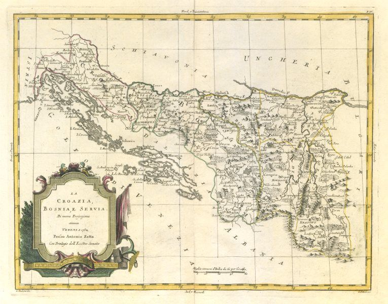

# Value

Astral is developing the standards and tools developers need to create location-based dApps and spatial contracts. We're thinking big - we aim to enable an ecosystem of applications by creating flexible and developer-friendly technologies that are native to Web3.

The past 15 years have seen the smartphone revolution - in 2021, it's hard to imagine life without location-based applications. Maps, dating, social networking, mobility, peer-to-peer goods markets - the usefulness of so many of the apps we use every day relies on some location element. 

Concurrently, the past decades have seen a revolution in Earth observation technologies - a greater number of more sophisticated remote sensing satellites are orbiting our planet every year. These sensors - combined with advancements in techniques for analyzing spatial data - are enabling us to glean new insights about our world at a profound level of detail. Insights like wildlife movements and illegal fishing, greenhouse gas emissions, deforestation, consumer behavior and so on are becoming an increasingly important factor in the decision-making of businesses and governments.

### Astral

Astral is creating tools and standards to work with geospatial and location data in the Web3 universe. To be truly Web3 native, we need to create technologies that are trustless, independently verifiable, next to impossible to take down and that empower the user. To do this, we are delving into the bleeding edges of some of the most exciting technologies on the web - blockchains, smart contracts, decentralized identifiers, verifiable claims, cryptography, token engineering and more.

#### Enabling an ecosystem

The applications enabled by the spatial data layer of the decentralized web are wide-ranging and revolutionary - and we have barely touched the surface. We are learning by building - some examples:

* We prototyped [Spatial.sol](https://github.com/AstralProtocol/spatial-sol) - a library of geometric and topological functions in Solidity.
* We prototyped [Geolocker](https://github.com/johnx25bd/ethlondon), a verifiable spatial data registry on 3Box and Ethereum, with a team at ETHLondon 2020.
* We designed the Hyperaware Protocol - a spatial governance protocol for connected devices - and built [a prototype implementation](https://hyperaware.io/) - a congestion zone system running on IoT + smart contracts.
* We participated in KERNEL's Genesis Block, where a team formed and we built a ****[prototype sustainability-linked bond](https://github.com/AstralProtocol/sprout) ****on Ethereum and IPFS, which aligns financial and ecological incentives by adjusting the amount a borrower needs to pay each year based on a measurement of environmental health.
* We started work on "geographic decentralized identifiers", or GeoDIDs, during the APOLLO Fellowship, and won prizes at the ETHOnline and the SkynetDB hackathons for our work prototyping tools to work with satellite imagery stored using GeoDIDs.

All of these projects point towards our goal, which is to develop the capability to work with spatial data on the decentralized web. We've realized that we need to develop the specifications and tools needed to work with this type of data in the web3 space, without having to opt for a web2 alternative. 

Once we develop this, we open a brand new world of possibilities within the web3 space, that will allow: developers to leverage geospatial data within their applications; data providers to store and distribute their data efficiently and effectively; data scientists to manipulate, analyze, and share their findings in a more user friendly way.

