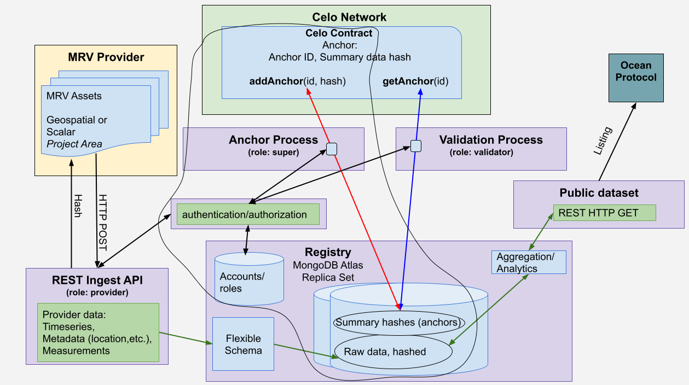

# Anchoring

<figure><figcaption>
Anchor process outlined
</figcaption></figure>

The anchor process, running under the 'super' role, retrieves a requested number of unanchored raw data points which have been hashed at ingestion. It then creates a "summary hash" by hashing the individual data point hashes.&#x20;

The created anchor instance id and summary hash are then stored in both the database and on the Celo contract, with the Celo transaction hash also applied back to the anchor instance on the database. The anchor instance id is then applied to each of the raw data points that comprise the transaction.

### Relevant code:

* [Anchor model test](https://github.com/MRV-Studio/openmrv-server/blob/main/src/test/anchor.model.spec.ts)
* [Anchor endpoint](https://github.com/MRV-Studio/openmrv-server/blob/cf60350381d5c98918a3d18ee90139680e5e492f/src/controller/super.controller.ts#L96)
* [Anchor service](https://github.com/MRV-Studio/openmrv-server/blob/main/src/service/anchor.service.ts)
* [Contract service](https://github.com/MRV-Studio/openmrv-server/blob/main/src/service/contract.service.ts)
* [Celo Contract](https://github.com/MRV-Studio/openmrv-contract/blob/main/contracts/GeodataAnchor.sol)
* [Contract anchor and validation integration test](https://github.com/MRV-Studio/openmrv-server/blob/main/src/test/localnode.test.ts)
