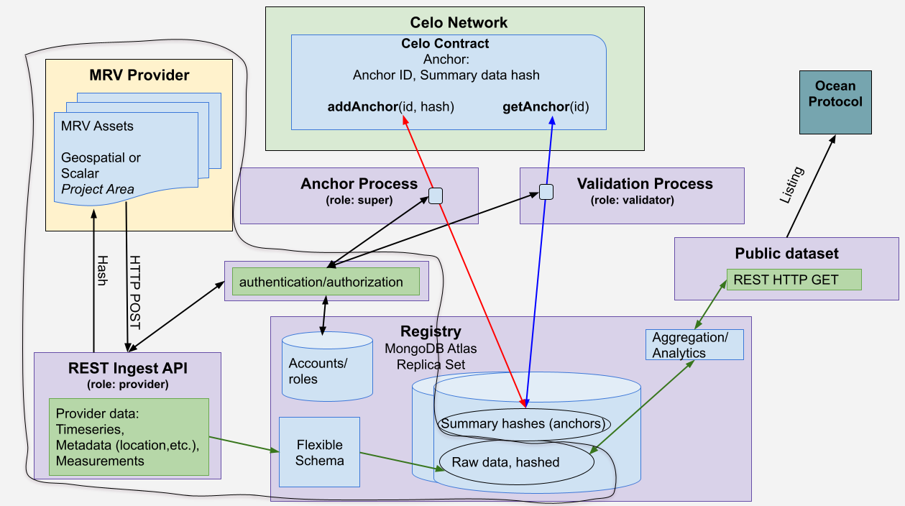

# Ingestion

<figure><figcaption><p>Ingestion layer outlined</p></figcaption></figure>


A client MRV Provider authenticates and receives a token containing the 'provider' role. With this token applied to an HTTP client header 'x-access-token', they will send (post) data in the form described by this flexible schema example:&#x20;


<figure><figcaption><p>Details of ingested data point</p></figcaption></figure>


```bash
# sample post with curl
export PROVIDER_PASS=<provider password>
export HOST=https://<host>/api

eval "$(jq -M -r '@sh "ACCESS_TOKEN=\(.tokenData.token)"' <<< "$(curl -H 'Content-Type: application/json' -X POST -d '{"email":"provider@iwahi.com","password":"'"$PROVIDER_PASS"'"}' $HOST/53f889/2cfae1)")"
echo $ACCESS_TOKEN

curl -s \
     -w '\n' \
     -H "Content-Type: application/json" \
     -H "x-access-token: $ACCESS_TOKEN" \
     $HOST/94cbae/4d46c9 \
     -d '{"metadata": 
            {"location": {"geometries": [
                {
                "coordinates": [
                -73.9132,
                40.68405
                ],
                "type": "Point"
                }
            ],
            "type": "GeometryCollection"
            },
            "model": "mri-esm2-ssp126",
            "project_id": "proj_29lo8RFQiVowh4u5WHdbFSLKExL",
            "provider": "tSuqRPkLVfDqQG3mgr0x4",
            "source": "station xxxxx"
  },
  "ts": "'"`date +"%Y-%m-%dT%H:%M:%S%z"`"'",
  "measurements": [
    {
      "type": "T",
      "unit": "C",
      "value": 20
    },
    {
      "type": "H",
      "unit": "P",
      "value": 30
    }
  ]
}'
# return value, with id/data hash:
{"geots":{"_id":"tcXoR-E50jQg-j3iUapcS","metadata":{"source":"station xxxxx","model":"mri-esm2-ssp126","project_id":"proj_29lo8RFQiVowh4u5WHdbFSLKExL","anchor":null,"ip":"127.0.0.1","provider":{"_id":"tSuqRPkLVfDqQG3mgr0x4","name":"Sample Provider","path":"4818b0","id":"tSuqRPkLVfDqQG3mgr0x4"},"location":{"type":"GeometryCollection","geometries":[{"type":"Point","coordinates":[-73.9132,40.68405]}]}},"ts":"2022-09-07T20:21:10.000Z","measurements":[{"type":"T","unit":"C","value":20},{"type":"H","unit":"P","value":30}],"hash":"3a968d77d2864f6c5e85d287fa8c7c9b12d04dfef5956f03b7ee4218bf8b4076","__v":0}}
```


Location can be an array of points or polygons. See the measurements interface definition below for currently supported data types and units of measure.

### Relevant code:

* [Endpoint test](https://github.com/MRV-Studio/openmrv-server/blob/main/src/test/provider.controller.spec.ts)
* [Endpoint Implementation](https://github.com/MRV-Studio/openmrv-server/blob/main/src/controller/provider.controller.ts)
* [Service Implementation](https://github.com/MRV-Studio/openmrv-server/blob/main/src/service/ingest.service.ts)
* [Top level data schema interface definition](https://github.com/MRV-Studio/openmrv-server/blob/main/src/interface/geots.interface.ts)
* [Metadata interface definition](https://github.com/MRV-Studio/openmrv-server/blob/main/src/interface/metadata.interface.ts)
* [Location interface definition](https://github.com/MRV-Studio/openmrv-server/blob/main/src/interface/location.interface.ts)
* [Measurements interface definition](https://github.com/MRV-Studio/openmrv-server/blob/main/src/interface/measurement.interface.ts)
