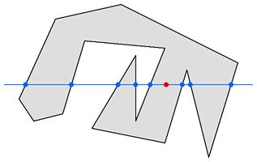

# Build Astral

We are actively developing the **Data** and **Spatial Contracts** layers of the Astral stack, and are looking for designers and developers who want to support our work. Please reach out if you're interested, and stay tuned as we release alpha versions of the software tools that will support our progress.

Specifically, we are looking for:

* Protocol Engineer
* Product Designer
* Mobile / Full Stack Developers
* Solidity Developer
* Community Manager

### Data

We're developing Geographic Decentralized Identifiers \(GeoDIDs\) as the primitive to wrap spatial data. 

### Oracles

To date our oracle systems are quite simple, and we're looking for developers who are interested in implementing those to pull spatial data from GeoDIDs into smart contracts.

### Spatial Contracts

We have been developing patterns and libraries to work with spatial data in smart contracts for a few years now, and are looking for additional support. Specifically, we are working on:

* A Solidity library of geometric and topological functions, much like [Turf.js](https://turfjs.org/).
* A verifiable spatial data registry for GeoDIDs:
  * A zone registry, where users can control polygons representing areas of space on, beneath or above the Earth's surface.
* Front-end packages and dApp interfaces to connect with spatial contracts.

