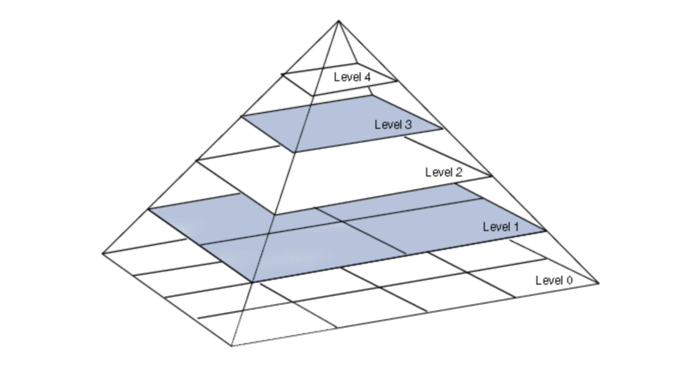
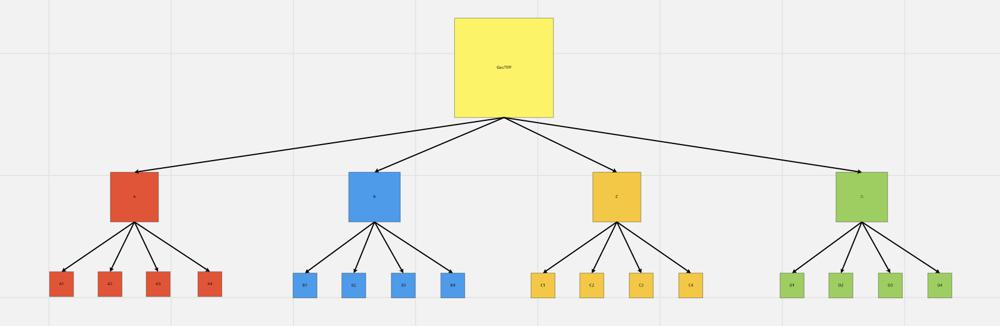

# GeoTIFFs and IPLD

## Introduction

One of Astral's main goals was to bring cloud native Geospatial capabilities to the Web3 space. While working with Protocol Labs tech for the past few months, we gained some insight into how, IPLD data structures, libp2p, IPFS, FFS, can enable us to make the aforementioned a reality. 

We knew we had to experiment with different pieces of tech, in order to understand what's possible, and what we could do to improve the existing tools. With Raster Imagery being so important to the Geospatial community, we challenged ourselves to figure out how we could  bring Cloud Optimized GeoTIFF-esque type functionality to IPFS/FFS. In order to understand what we're trying to accomplish, we need to first understand what is a TIFF and GeoTIFF.

## TIFFs, GeoTIFFs, and COGs

### What is a TIFF? 

A TIFF or TIF, Tagged Image File Format, represents raster images that are meant for usage on a variety of devices that comply with this file format standard. The [_TIFF specification_](https://www.itu.int/itudoc/itu-t/com16/tiff-fx/docs/tiff6.pdf) defines a framework for an Image File Header \(IFH\), Image File Directories \(IFDs\), and associated bitmaps. Each IFD and its associated bitmap are sometimes called a _TIFF_ subfile.  The TIFF is capable of describing bilevel, grayscale, palette-color and full-color image data in several color spaces. It supports lossy as well as lossless compression schemes to choose between space and time for applications using the format. The format is not machine dependent and is free from bounds like processor, operating system, or file systems.

### What is a GeoTIFF?

A GeoTIFF is a public domain metadata standard which allows georeferencing information to be embedded within a TIFF file. The potential additional information includes map projection, coordinate systems, ellipsoids, datums, and everything else necessary to establish the exact spatial reference for the file.

### **What is a Cloud Optimized GeoTIFF?**

A [Cloud Optimized GeoTIFF \(COG\)](https://www.cogeo.org/) is a regular GeoTIFF file, aimed at being hosted on a HTTP file server, with an internal organization that enables more efficient workflows on the cloud. It does this by leveraging ​HTTP GET range requests to ask for just the parts of a file the client needs. “COG is the ideal pair for a STAC Item” - the two standards were designed to complement one another.

By pre-processing the GeoTIFF and breaking it into several pieces, a number of internal ‘tiles’ are created inside the actual image, instead of using simple ‘stripes’ of data. With tiles, much quicker access to a certain area is possible, so that just the portion of the file that needs to be read is accessed.

In addition, during the pre-processing, multiple ‘overviews’ will be computed and incorporated into the image file - basically several downsampled versions of the same image - so that you can query the highest quality version depending on the level of resolution desired.

In order to achieve this, the client uses HTTP GET Range requests to request the range of bytes that are within the zoom scope, or map viewport, from the server. This method is also called byte serving, where the client can request just the bytes that it needs from the server. On the broader web it is very useful for serving things like _video_, so clients don’t have to download the entire file to begin playing it.

### TIFF Internal Overview

The TIFF format allows you to store more than one image, the same way a PDF can store more than one page. This can be used to create the overviews or pyramids. Each overview will divide the image in four from the previous level, so a smaller amount of data can be read. In our case, a thumbnail of a huge GeoTIFF could be easily shown without reading all the pixels. 

This is independent of the tiling part, but combining both allows to make efficient files for reading a small part of the image and for zooming out efficiently at the same time. 

* Overviews create downsampled versions of the same image.
* "Zoomed out" versions of the original image.
* Lesser detail & smaller size.
* Multiple overviews, to match different zoom levels.
* Adds to overall file size, but is served much faster.

### Image Pyramids

The use of image tiling and image pyramids supports the display of high-resolution images with a high level of performance. An image pyramid consists of a base image and a series of successively smaller sub-images, each at half the resolution of the previous image. The following figure shows the tiled base image \(Level 0\) and successively smaller sub-images. The sub-images correspond to lower resolution levels. 



## IPLD

IPLD is an ecosystem of formats and data structures for building applications that can be fully decentralized. This ecosystem has a set of tools that allow us to serialize pieces of data, into CIDs and its respective binary, then encode them with a codec that creates a "linked data model" between the various CIDs. If you would like to know more about the specifics of IPLD, please refer to the official [documentation](https://docs.ipld.io/#what-is-ipld). 


### Replacing the GeoTIFFs IFD with IPLD

Essentially our goal is to take a GeoTIFF \(that is a STRIPE image in this stage\), pre-process the image by tiling the STRIPE image and then creating the respective overviews for each tile. Instead of the tiles and overviews being stored in the TIFF's IFD \(Image File Directory\), we’re thinking we can use IPLD to store the tiles and overviews instead. With each tile/overview having their own CID, we can then use these to query the proper tiles/overviews. 

In theory it sounds like it would work, and we know there will be some downsides to this approach \(speed, efficiency, and lack of adoption for right now\). But we would still like to see where this could go and if IPLD could be used to enable CID GET Range requests for geospatial raster data. 

## Mental Model

Below are some visualizations of the mental model of the IPLD TIFFs. Each block, regardless of size or color, has a [IPLD Block](https://github.com/ipld/js-block#readme) associated with it, meaning that it contains a `cid` and binary `data` field.

#### Tile Overview


Figure 3, is a generic example of a GeoTIFF image and what it looks like when tiled. If you're zoomed out the client will most likely pull the whole image\(yellow\). But say that you only want the raster imagery corresponding to a small area within the GeoTIFF. Then the client should at this point use the bounding box data to fetch the appropriate tile and the proper overview \(ex. \[A2, B1, A4, B3\]\).

#### Relationship Overview



Figure 4, shows the relationships that we tried to emulate, but ended up creating a variant of this model. This model is just for you to visualize how we can wrap sub tiles within larger ones. Just like how the IFD creates tags at the offsets for the data Overviews and TIFF metadata. The DAG-CBOR encoded Blocks, also create tags to identify nested CIDs within it. By leveraging the tag feature, we can query and quickly access the information we need.

### Example of the implementation in the package:

```typescript
import { getImageFromUrl, startTile, getGeoTile } from "ipld-geotiff";
import { IPFS, create } from "ipfs";

async function example(){
    const url = 'http://download.osgeo.org/geotiff/samples/gdal_eg/cea.tif';
    
    // bbox that is sent from client
    const request = [
        -28493.166784412522,
        4224973.143255847,
        2358.211624949061,
        4255884.5438021915
    ];
    
    // First create instance of IPFS
    const ipfs: IPFS = await create();
    
    // Request TIFF from Endpoint
    const image = await getImageFromUrl(url);
    // Start the tiling and encoding process 
    const ires: IResponse =  await startTile(ipfs, image);

    // Use GetGeoTile to obtain the tile that you would like
    const tiff_of_tile = await getGeoTile(ipfs, ires.cid, ires.max_Dimensions);
}
```

## Conclusion

By using IPLD and pre processing the GeoTIFF, we were successfully able to replicate the IFD functionality. With IPLD tagging the nested CIDs of the serialized tiles, we can resolve to the proper tile that we need if we have the path configured ahead of time. This is how we approached enabling "byte-serving" capabilities on IPFS, but we acknowledge that there are some improvements that could be made in future iterations. These improvements could drastically improve the performance of the tool, and user experience. 

### What could be improved?

As of right now, the pre-processing of the image isn't as effective as it could be. Basically we are trying to tile the image ahead of time, but there are infinite possibilities within the image. So realistically we cannot really select ONLY the bits we need. We have to request the bits and some, as we need to query the tiles that encompass the bbox/window. Another disadvantage with our current solution is that we are actually pinning duplications of the image at different overview/ tile sizes. This is because we completely get rid of the IFD within the GeoTIFF. The problem with this approach is that we have to process the image multiple times. Instead we hope to process the image less than before, and combine the IPLD and IFD, so that they can complement one another. 

### How we plan to further our research?

In order to further our research, we would like to develop another iteration of  IPLD-encoded GeoTIFF, which can hopefully be extended to provide byte serving capabilities to other files types as well. We want to experiment with a custom IPLD codec that is specifically meant for TIFF filetypes. Maybe the codec's structure could complement the TIFFs structure? 

We also need to incorporate the function/package that will auto-resolve to the proper piece of data, so that the UX is easier and the end user doesn't have to know paths and CIDs beforehand. Instead we want to enable CID GET Range requests, where the selected/targeted bytes are encoded within the CID, for ease of access from the client. 

We'd also like to apply the technique to vector tiles, which use a similar tiling system to create downsampled PBF files of vector geometries. 

These will each enable a more effective way to query spatial data from IPFS by significantly reducing downloading times, costs, and resource use - and serve as a step towards Web3-native geospatial technology.

#### We plan to focus on the following:

* Chunking and Distribution of Large Files \(LANDSAT\)
* Real Time & Dynamic Processing
* Minimize Data Duplication
* See if Custom Codec is necessary, or if DAB-CBOR still suffices
* Leverage IPLD Selectors to query data efficiently.
* Explore the IPLD's Advanced Data Layouts 
* Compression
* IPLD Byte Serving Spec


