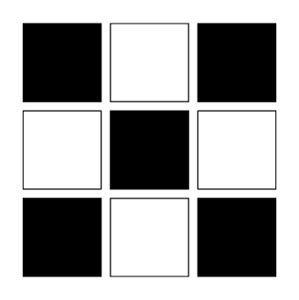

# Intro

A GeoDID is a [decentralized identifier](https://w3c-ccg.github.io/did-spec/) for identifying _**spatial data assets**_ for use in Web3 applications. 

GeoDIDs are:

> **✅ User-controlled.**  
> DIDs are independently created in a permissionless way: no centralized authority is required to approve or issue identifiers.  
>   
> **✅ Cryptographically-verifiable.**  
> DIDs are controlled using cryptographic keys. \(more detail here?\)  
>   
> **✅ Versatile and platform agnostic.**  
> GeoDIDs are designed to represent spatial data assets in as flexible a way as possible. This means they can be adapted to suit user requirements - important for enterprise and government adoption.  
>   
> **✅ Web3-native. \(?\)**  
> GeoDIDs are optimized to be decentralized. \(more detail and justification here\)

\[sweet satellite image here\]

### Why are GeoDIDs necessary?

Spatial data is any data where the relative positions of observations are described by the data, and can be used as a dimension in the analysis. Put another way, spatial data has information about _where each individual datum is_ — and therefore, where the observations are in relation to each other.

A wide range of data formats have been developed to represent spatial data for a broad array of use cases and applications. Geographic decentralized identifiers act as a wrapper around these spatial data assets. This provides a common structure for referencing spatial data, and gives developers the option to bring these data assets into the Web3 fold, offering **independently verifiable cryptographic integrity guarantees**, the ability to store spatial data on **distributed file storage** systems like IPFS,  and, most importantly, giving the GeoDID controller full, **permissionless autonomy** over their spatial datasets through the use of public key cryptography. \(privacy?\)

\[@jared and @joao: is this a good justification for why GeoDIDs are necessary.\]


Our vision is to develop a set of tools for working with spatial data in smart contracts, oracles and other Web3 systems. These tools will be developed to natively consume spatial data identified by GeoDIDs.


### What is a "spatial data asset"?

> **Why is spatial special?** An explanation of how spatial data assets are a special class of data assets, and why spatial data requires its own specialized specification.

A **spatial data asset** is any data asset that contains spatial or location information. This term is intentionally broad - GeoDIDs are flexible enough to identify legacy spatial data types, as well as ones that haven't been developed yet. 

Spatial data assets tend to fall into two categories: **raster** and **vector**. 



Raster data are composed of grid cells identified by row and column. The whole geographic area is divided into groups of individual cells, which represent an image. Satellite images, photographs, scanned images, etc., are examples of raster data \([Janipella et al 2019](https://www.sciencedirect.com/topics/engineering/spatial-data)\).

A \(very\) simplified representation of a 3x3 pixel raster image in Python:

```text
img = [[ 1, 0, 1 ],
       [ 0, 1, 0 ], 
       [ 1, 0, 1 ]]
```





In a vector dataset, **features** are individual units in the dataset, and each feature typically represents a _point_, _line_ or _polygon._ These features are represented mathematically, usually by numbers that signify either the coordinates of the point, or the vertices \(corners\) of the geometry \([johnx25bd 2019](https://towardsdatascience.com/spatial-data-science-for-the-uninitiated-9a78804d4efa)\).

```text
point =   [ 45.841616, 6.212074 ]

line =    [[ -0.131838, 51.52241 ],
           [ -3.142085, 51.50190 ],
           [ -3.175046, 55.96150 ]]
           
polygon = [[[ -43.06640, 17.47643 ],
            [ -46.40625, 10.83330 ],
            [ -37.26562, 11.52308 ],
            [ -43.06640, 17.47643 ]]]
            # ^^ The first and last coordinate are the same
 
```





Spatial data assets are data assets - binary files, or directories of files - that contain spatially-referenced information. For v0.0, GeoDIDs natively support GeoTIFF and GeoJSON files, which are commonly-used raster and vector data formats respectively. In the future, spatial data of any format can be identified using a GeoDID, and these format extensions can be built for the `@astral-geodid` software modules.


More background on [GeoJSON](https://macwright.com/2015/03/23/geojson-second-bite.html) and [geojson.io](http://geojson.io/), a tool for creating and exploring GeoJSON files, and more on [GeoTIFFs](https://www.gislounge.com/what-is-a-geotiff/), plus a [sample](https://cbers.stac.cloud/item/wMAdB8x2xmsNbdUHrc28srEdZpy/A6ExZs3csirxV7jSsrFicBf2TKBJB9xubxeAy/h88cG3tZLsmVu6iM7Mjx5Pg5agdpJnF346adC9/5XYvhxvrpCphAXhLWgKjphETpsBRhKdZV1d8LAooTo3K/93J54CWKozr1bRfaJ86XbTqHyztjFiPbckxGhpGCb9tDFFyG9NFRRyXGchpjoZzHNL2HJ2PYVENgW9?si=0&t=preview#6/-34.060280/-64.037544).


### GeoDIDs

#### The Core Specification

> We are early in developing the GeoDID spec. For now, we are focused on storing `geojson` vector spatial data structures, and `geotiff` raster data. The GeoDID specification is designed to be flexible and identify any spatial dataset in any format - even ones that haven't been developed yet.

#### GeoDID Extensions

Each spatial data asset is referenced in an object stored in the GeoDID document's array of service endpoints. This allows a single GeoDID to represent multiple spatial data assets, including of heterogeneous types \(shapefiles with GeoTIFFs, multiple LIDAR point clouds, etc etc.\)

One of the required attributes contained in the `service` objects is the format of the spatial data asset referenced: `geotiff`, `shapefile`, `geojson` \(?\) etc. For v0.0, we have implemented `geotiff`, `geojson` and `stac-json` and `stac-ipld` spatial data asset types. These attributes allow the `@astral-protocol/astral-_______` \(@Jared?\) module to resolve and unpack the spatial data asset appropriately.

// Compression? `shapefile-zip`, or `{"type": "geojson", "compression": "gzip", ... }`

Table: GeoDID Extensions

### Storing spatial data

Web3-native storage: IPFS

CID, URI, whatever.

### Creating GeoDIDs

### Reading / Resolving GeoDIDs

### Updating GeoDIDs

### Deleting GeoDIDs

Public GeoDIDs: if registered on a public blockchain, \_\_\_\_.

### 

