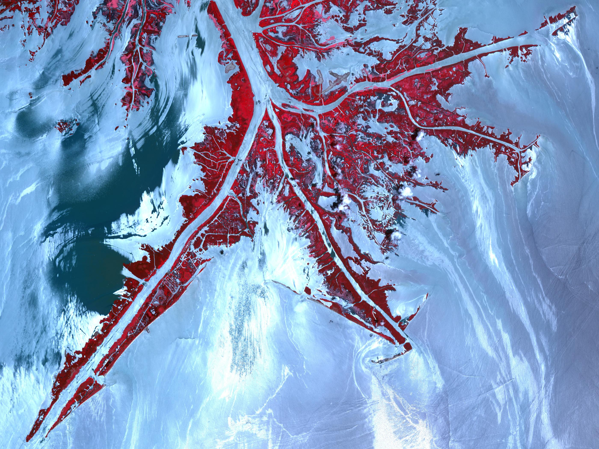

# Introduction: GeoDIDs

A GeoDID is a [decentralized identifier](https://w3c-ccg.github.io/did-spec/) for identifying _**spatial data assets**_ for use in Web3 applications. GeoDIDs act as a wrapper location or spatial data like points, lines and polygons, or satellite images, LiDAR scans and 3D models. By using DIDs, we can confidently store and access these spatial data assets.

GeoDIDs are:

**✅User-controlled.**  
DIDs are independently created in a permissionless way: no centralized authority is required to approve or issue identifiers.

**✅Cryptographically-verifiable.**  
DIDs are controlled using cryptographic keys - not your key, not your data.

**✅Versatile and composable.**  
GeoDIDs are designed to represent spatial data in as flexible a way as possible. This means they can be adapted to suit user requirements - from cryptonative dapps to enterprise and government use cases - and can be [integrated across platforms and ecosystems](https://github.com/ceramicnetwork/ceramic/blob/master/OVERVIEW.md#interoperable-data-ecosystems).

**✅Web3-native.**   
GeoDIDs are built to be a building block for the mobile and location-based decentralized web. 

### What is spatial data? 

Spatial data is any data where the relative positions of observations are described by the data, and can be used as a dimension in the analysis. Put another way, spatial data has information about _where each individual datum is_ — and therefore, where the observations are in relation to each other.

A [wide range of data formats](https://en.wikipedia.org/wiki/GIS_file_formats#Raster_examples) have been developed to represent spatial data for a broad array of use cases and applications. Geographic decentralized identifiers act as a wrapper around these existing spatial data formats - meaning GeoDIDs interoperate with existing spatial datasets, and ones yet to be created.



### Why are GeoDIDs necessary? 

By wrapping spatial data assets in GeoDIDs, we create a common structure for referencing spatial data. This gives developers the option to bring these data assets into the Web3 fold, offering **independently verifiable cryptographic integrity guarantees**, the ability to store spatial data on **distributed file storage** systems like IPFS,  and, most importantly, giving the GeoDID controller full, irrevocable **permissionless autonomy** over their spatial datasets through the use of public key cryptography. 


Our vision is to develop a set of tools for working with spatial data in smart contracts, oracles and other Web3 systems. These tools will be developed to natively consume spatial data identified by GeoDIDs.


### How do I use GeoDIDs?

To easily create, read, update and destroy GeoDIDs, Astral is developing software modules to abstract away a lot of complexity of working with DIDs, varying spatial data formats etc. 

These docs will help you learn more about spatial data and how it works, exactly what's going on under the hood with GeoDIDs, or to dive straight into building.





