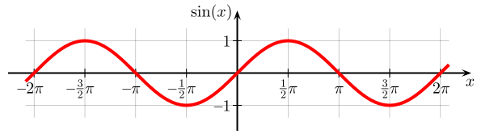
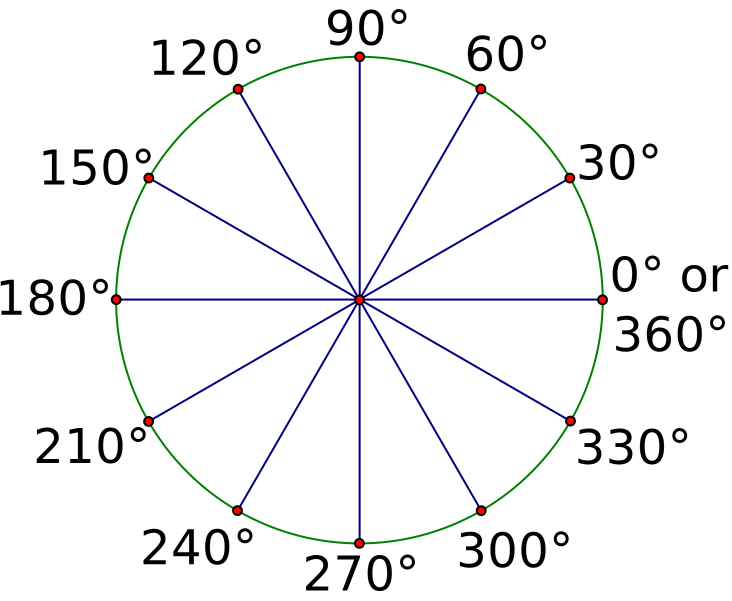

# Ecological State

`Ecological Index` is an on-chain variable that represents the value of the ecological asset stored in the GeoNFT. Depending on the application's requirements and data collected, it could be a measurement of area, soil health, biodiversity, carbon sequestration, or other calculation.

## Area Calculation

Area is a simple way of calculating ecological value using the topological data represented by the GeoJSON. For instance, if a steward of an asset has agreed to follow regenerative practices, the size of that natural space plays a key role in its value. When using fractionalization, token supply would be controlled by this value, so it's important to accurately calculate area using on-chain functionality.

Below is a description of how we calculated the ellipsoidal area of `Polygon` and `MultiPolygon` geometries on-chain.

### Implementation

The area calculation of a surface can be approached in different ways. A very simple and straightforward one is to display the coordinates on a flat plane. Doing so, the area calculation is similar to any irregular geometric figure. It’s very common to use the planar representation of maps (called “projected” coordinate systems) because they are easier to view and work with. One example is Google Maps, which uses the [Pseudo-Mercator](https://en.wikipedia.org/wiki/Web\_Mercator\_projection) (or Web Mercator) projection. It was initially conceived as a variant of the Mercator projection (the one used on typical physical maps), and has become the standard for mapping applications.

However, in our implementation, we calculate the ellipsoidal area based on the spherical representation of the Earth instead of on a flat plane. Calculating the area over a sphere is more difficult, but the result is more accurate.

### Challenges

Calculating the area on-chain using Solidity has some challenges that are not present in most standard programming languages. There are two aspects that make it difficult:

1. decimal handling and irrational constants (such as pi)
2. trigonometric functions (sine function is needed in the area calculation algorithm).

#### Decimal Handling

Handling decimals is a well-known topic in the Solidity community: you need to multiply the value by some factor, do the calculations and, finally, divide by that same factor. In the end, the result should be valid (with some error deviation). This is used, for example, on the input coordinates. The range of valid numbers are \[-90, 90] for latitude and \[-180, 180] for longitude. Operating without decimals in this context is useless because of the lack of precision, so we are applying a factor of $$10^9$$ to operate with integer values. This is also applied to constant values such as the earth radius, pi, etc.

#### Trigonometric Functions

However, using trigonometric functions in Solidity is not an easy thing. Typically, trigonometric functions (sine, cosine, tangent) work with radians, and the result lives bounded in a very specific domain. For example, the range of sine and cosine values is \[-1, 1]. Given that, it is impossible to operate without decimals, and there is no built-in sine function in Solidity.

<figure><figcaption><p><em>Graph of the sine function.</em> By <a href="http://commons.wikimedia.org/wiki/User:Geek3">Geek3</a> - Own work, Public Domain, <a href="https://commons.wikimedia.org/w/index.php?curid=4013293">Link</a></p></figcaption></figure>

The solution to this was found by Lefteris Karapetsas for his [Sikorka](https://github.com/Sikorkaio/sikorka/blob/master/contracts/trigonometry.sol) app which was based on the C library named [trigint](https://www.dribin.org/dave/trigint/) that, in turn, was an implementation of Scott Dattalo's [sine wave routine for the PIC microcontroller](http://web.archive.org/web/20120301144605/http://www.dattalo.com/technical/software/pic/picsine.html). In all cases, the problem was the same: calculate the sine of an angle using only integer values. In summary, the solution is to pre-calculate all the values and store them in a hash table. This may be done in a programming language that supports standard sine calculation (e.g. Python) and export the hash table in a format compatible with Solidity. That format is a [string of hexadecimal values](https://github.com/AstralProtocol/geonft-registry-poc/blob/main/packages/hardhat-ts/lib/Trigonometry.sol#L33).

```solidity
bytes constant SIN_TABLE = "\x00\x00\x00\x00\x00\xc9\x0f\x88\x01"; //truncated for readability
```

But, how is that table built? Excluding decimal values, a circle can be split in 360 parts, each one representing an angle of 1 degree. We could calculate the real sine value for each degree and store it on the hash table. But this doesn’t give us a lot of precision, especially in a geospatial coordinate system context (68.1º and 68.9º will relate to the same value).

<figure><figcaption><p><em>30 degree reference angles.</em> By <a href="https://commons.wikimedia.org/wiki/User:Adrignola">Adrignola</a> - Own work, <a href="http://creativecommons.org/publicdomain/zero/1.0/deed.en">CC0</a>, <a href="https://commons.wikimedia.org/w/index.php?curid=12885430">Link</a></p></figcaption></figure>

A way of improving this is to split the circle into more units, thus increasing precision. Splitting the circle into 16,384 units allows storing the angle parameters as unsigned 16-bit data types (as used in the trigint library). In our case, we needed even more precision in order to accurately calculate the area. We used a 256-bit data type to store the values of up to 1,073,741,824 angle units in a circle. With this method we were able to achieve an error deviation of < 0.1% on very small areas.

## Future Plans

Ecological state calculations will be expanded to include other indexes based on data collected for an ecological asset. These values could be determined by machine learning models or other algorithms.

As such, we have separated the area calculation into a separate library from the GeoNFT contract, thus making it easy to replace when adding other ecological calculations.\
