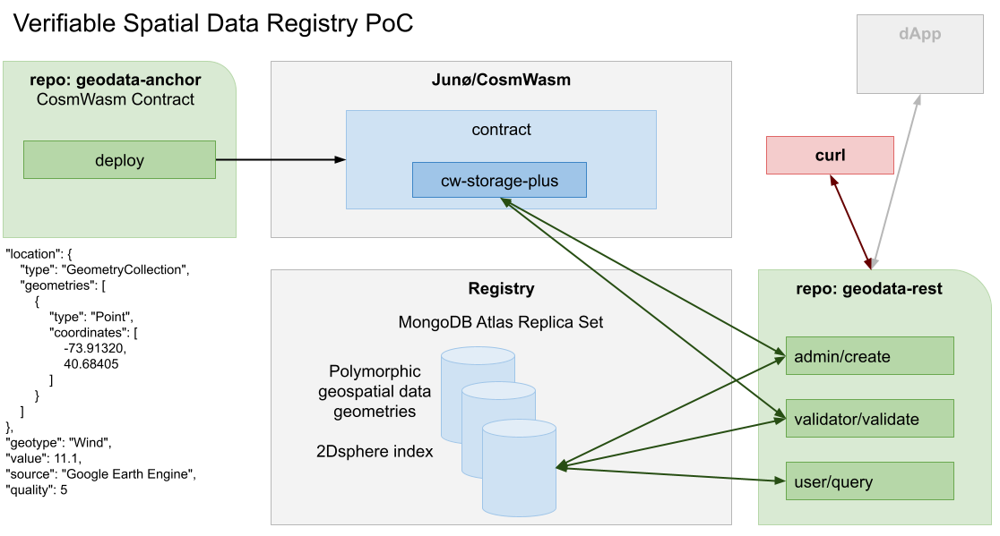

# Geospatial Data Registry PoC

With [geodata-anchor](https://github.com/dclimate/geodata-anchor) (Junø/CosmWasm contract) and [geodata-rest](https://github.com/dclimate/geodata-rest) (HTTP REST Server) we address the feasibility of providing performant and scalable access to geospatial data in geojson format, leveraging MongoDB’s [geospatial data and queries](https://docs.mongodb.com/manual/geospatial-queries/#geospatial-queries). When a data item is ingested into the database, a hash of the relevant data is generated and stored on a CosmWasm contract which implements a [cw-storage-plus](https://crates.io/crates/cw-storage-plus) indexed datastore. Validation results are stored on both the database and the contract. Validators would each run a [MongoDB Atlas](https://www.mongodb.com/basics/mongodb-atlas-tutorial) replica instance, with an independent compute instance performing the same hashing algorithm.

### Current PoC implementation: 

* Fully written in [Rust](https://www.rust-lang.org/), using [axum](https://github.com/tokio-rs/axum) and [cosmos-rust](https://github.com/cosmos/cosmos-rust).
* Role-based access to rest endpoints: admin role creates data items, validator role validates, and user role can query.
* Polymorphic (polygon, point, line, etc.) geospatial data [geometries](https://docs.mongodb.com/manual/reference/geojson/#geometrycollection) within a single [2dsphere](https://www.mongodb.com/docs/manual/core/2dsphere/) index.
* Validation compute currently occurs via a REST endpoint based on userid/role and is not yet tied to a validator’s specific replica instance.
* Integration tests for both geodata-anchor and geodata-rest run against a local instance of [Junø](https://docs.junonetwork.io/juno/readme) via Docker; we have not yet deployed to a testnet.

### Possibilities:

* Evolve hashing strategies via [multi-hash](https://github.com/multiformats/rust-multihash).
* Larger datasets could leverage MongoDB [sharding](https://www.mongodb.com/docs/manual/sharding/) features.
* Reverse anchor hash from contract to database.
* Move most data onchain, queried directly via secondary indexes, with links to IPFS, Arweave or MongoDB Atlas for large objects.
* 3D geospatial index design and implementation with cw-storage-plus secondary [indexes](https://docs.cosmwasm.com/tutorials/storage/indexes).

### Tokenomics: 

* Mostly beyond the scope of this PoC, but with [interchain accounts](https://blog.cosmos.network/interchain-accounts-take-cosmos-interoperability-to-the-next-level-39c9a8aad4ad) and the [Gravity Bridge](https://blog.cosmos.network/gravity-is-an-essential-force-of-the-cosmos-aligning-all-planets-in-orbits-in-the-composable-b1ca17de18cc) on Cosmos, many possibilities exist for [application-specific blockchains](https://medium.com/cosmwasm/cosmwasm-for-ctos-f1ffa19cccb8).

Thank you to [dClimate](https://www.dclimate.net/) for funding this PoC and providing valuable technical direction.

\
