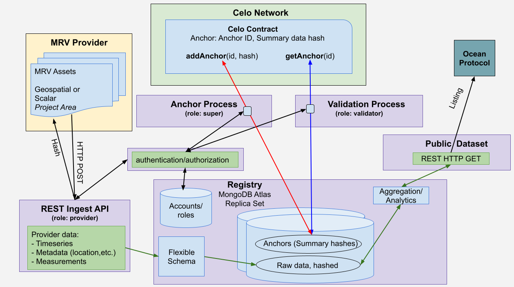

# Technical Design

<figure><figcaption>
Celo Verifiable Spatial Data Registry MVP - technical design
</figcaption></figure>

Overall design diagram shows all moving parts; data flow is from left to right. Detail pages for each process follow.

Functionality is managed and secured with authentication and authorization via HTTP interceptors. Account creation and management runs under the 'super' role:

### Relevant code:

* [User role test](https://github.com/MRV-Studio/openmrv-server/blob/main/src/test/user.controller.spec.ts)
* [Super role test](https://github.com/MRV-Studio/openmrv-server/blob/main/src/test/super.auth.controller.spec.ts)
* [Super endpoint](https://github.com/MRV-Studio/openmrv-server/blob/main/src/controller/super.controller.ts)

