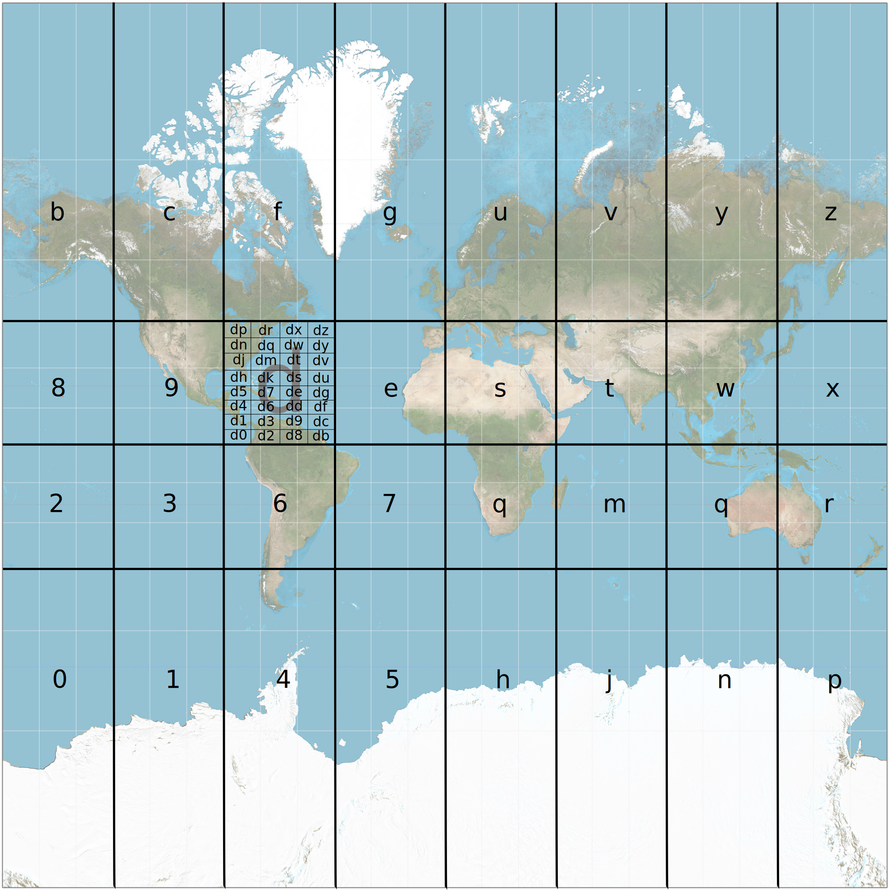
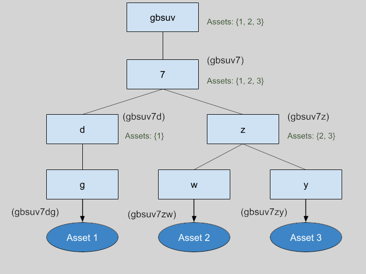

# On-chain Spatial Data Registry

The fully decentralized spatial data registry stores all data on-chain. Due to technology limitations, we built a lightweight solution to organize and query the geospatial data using the [geohash](https://en.wikipedia.org/wiki/Geohash) geocode system to build a data structure called a `GeoTree`.

## Geohash

Geohashing is a method that encodes coordinates as a string of characters. In the geohash system, the Earth's surface is divided into 32 rectangles, each one corresponding to a specific  character. The characters include all numbers and letters except `a`, `i`, `l` and `o`. Each top level rectangle is subsequently divided into 32 rectangles, representing a second level of detail. This pattern can be continued for an infinite number of nested rectangles, so that every level corresponds with its identifier character — but the convention defines a maximum level of 12. The more characters we specify, the smaller the rectangle will be. For example, the geohash `de2f7` with five characters is five nested rectangles deep.


In the Solidity contract, latitudes and longitudes are stored as signed 64-bit integers. At this level of precision, the maximum level of geohashing is 12, providing a geolocation precision of 3.7 \* 1.9 cm.


<figure><figcaption><p>geohash level 1 with "d" divided to show level 2. Base map by <a href="https://commons.wikimedia.org/wiki/User:Strebe">Strebe</a> - Own work, <a href="https://creativecommons.org/licenses/by-sa/3.0">CC BY-SA 3.0</a>, <a href="https://commons.wikimedia.org/w/index.php?curid=17700069">Link</a></p></figcaption></figure>

The short alphanumeric format of a geohash lends itself well to a Solidity implementation that doesn't support floating point numbers. Additionally, it's convenient to remove characters from the end of a hash to query locations that are less and less precise.

### Point Locations

Our current implementation of the spatial data registry only indexes a single latitude/longitude point. For polygons, we calculate the centroid off-chain and use that value to register a location.

The registry stores data at level 8, which corresponds to a square of 20x20 meters. Any point inside that square will be resolved to the same geohash.

## GeoTree

A GeoTree is a type of data structure that permits indexing of data that exist at different levels. Below is an example of GeoTree indexing two-dimensional data using geohashes. The top nodes of the tree correspond to geohash level 1 — we call them parent nodes. Child nodes are the bottom nodes of this diagram, and they represent level 2. In the GeoTree, nodes only contain one character, as the child nodes automatically inherit their parent’s value. By traversing from the root node to the end node, we can access each geohash character and build the complete geohash.

<figure><figcaption><p>level 1 node with two child nodes at level 2, full geohash value in parentheses</p></figcaption></figure>

The tree allows us to query data assets at any resolution by picking any node and traversing through all of its children to find all enclosed assets. For example, the level 5 geohash `gbsuv` represents a rectangle of approximately 5x5 km. To find all assets inside this area, we would select all child nodes with geohashes beginning with `gbsuv`. Let’s assume the end nodes of our system are the following:

* `gbsuv7dq`
* `gbsuv7zw`
* `gbsuv7zy`

The GeoTree data structure would look like this:

<figure><figcaption><p>intermediate node creation in a geotree</p></figcaption></figure>

Note that we’ve created all the intermediate nodes of the tree, including `d` and `z`, even though they didn’t contain data. This way, we can query any subtree at any level and get all of its children.

### Optimization

The above data structure allows us to query the GeoTree on a time complexity `O(n)`. We made the decision to improve the structure by caching all the enclosed assets at each intermediate node. This means that for every insertion, the asset will be stored on the end node and every parent of that node. The following illustration shows this:

<figure><figcaption><p>caching asset information at every node</p></figcaption></figure>

Even though this variant may have some drawbacks, we choose it because it pays off in terms of query efficiency. Time complexity would be as follows:

* **Insertion**: Process would be executed on every level (`k`). In a system with a depth of 8, `k` would be 8, so time complexity is `O(1)`.
* **Query**: Given that every node contains all its children assets, the querying process would only need one step, making time complexity `O(1)`.

Regarding the storage, this modification will increase its size from `n` to `(k+1)*n`. However, the depth of the tree (`k`) would usually be a low number, making the memory requirement `O(n)` — the same as the non-cached version.

### Solidity Implementation

Nested data structures such as trees are hard to implement in Solidity due to its limited functionality. However, the cached implementation of the GeoTree was achieved with a simple hash map. The key is the full geohash mapped to an array of asset values. Our previous example would be represented as follows:&#x20;

```
{
    "gbsuv"    =>  {1, 2, 3}
    "gbsuv7"   =>  {1, 2, 3}
    "gbsuv7d"  =>  {1}
    "gbsuv7dg" =>  {1}
    "gbsuv7z"  =>  {2, 3}
    "gbsuv7zw" =>  {2}
    "gbsuv7zy" =>  {3}
}
```
